# Sree’s Home Bakery — Full-Stack Platform & RAG Assistant

A modern, production-grade bakery management platform and grounded AI assistant built for **Sree’s Home Bakery** in Kakinada, Andhra Pradesh, India.

The platform provides a public luxury bakery website, customer ordering and custom cake builder portal, a full-featured administrative management dashboard, isolated customer reference image uploads, and an anti-hallucination Retrieval-Augmented Generation (RAG) assistant powered by vector retrieval and Groq LLM integration.

---

## Key Features

- 🍰 **Public Bakery Website:** Responsive luxury design system in warm bakery hues (`#FDFBF7`, `#2B1810`, `#8B263E`, `#FCECE9`, `#C58A32`), serif typography, full verified menu catalog, interactive gallery with lightbox, and dedicated page routes.
- 🎨 **Authentic Bakery Gallery:** 45 genuine high-resolution cake and treat photos extracted directly from the official bakery catalog with category filters and "Create Similar Cake" prefill.
- 🎂 **Custom Cake Studio:** Interactive custom cake builder with flavour, egg preference, tier/weight, occasion, and drag-and-drop reference photo upload.
- 👤 **Customer Account Portal:** Secure registration, bcrypt password hashing, session tokens, and order tracking with 7-stage lifecycle badges (`Pending`, `Reviewed`, `Confirmed`, `In Preparation`, `Ready`, `Completed`, `Cancelled`).
- 🛡️ **Bakery Admin Dashboard:** Secure management panel for bakery owners to view live order metrics, update enquiry statuses, edit the menu catalog, manage gallery items, view customer history, and rebuild RAG vector knowledge.
- 🤖 **Grounded RAG AI Assistant:** Context-grounded assistant combining deterministic fast-path retrieval, cosine vector similarity, and Groq LLM (`llama-3.3-70b-versatile`) with strict fallback guarantees against hallucinations.
- 🔒 **Isolated Upload Pipeline:** Customer reference images are stored strictly in `uploads/custom_cake_references/` with MIME/size validation and **never** enter the RAG vector store or public knowledge base.

---

## Architecture Overview

```mermaid
flowchart TD
    subgraph Client ["Frontend (React 18 + TypeScript + Vite)"]
        Nav[Navbar & Routing]
        Nav --> P_Home["/ (Home)"]
        Nav --> P_Menu["/menu"]
        Nav --> P_Custom["/custom-cakes"]
        Nav --> P_Gallery["/gallery"]
        Nav --> P_Treats["/special-treats"]
        Nav --> P_Order["/order"]
        Nav --> P_Contact["/contact"]
        Nav --> P_Auth["/login & /register"]
        Nav --> P_User["/user (Customer Portal)"]
        Nav --> P_Admin["/admin (Admin Dashboard)"]
        ChatWidget[Floating RAG Chatbot]
        ImageUpload[Drag-and-Drop ImageUpload]
    end

    subgraph Server ["Backend (FastAPI + Python 3.13)"]
        AppRouter[FastAPI Application Router]
        AppRouter --> RouteBakery["/api/bakery/* & /api/menu & /api/products"]
        AppRouter --> RouteAuth["/api/auth/* (register, login, admin-login, me)"]
        AppRouter --> RouteEnquiries["/api/enquiries/* & /api/user/enquiries"]
        AppRouter --> RouteAdmin["/api/admin/* (overview, enquiries, menu, gallery, rag)"]
        AppRouter --> RouteUpload["/api/upload-reference"]
        AppRouter --> RouteChat["/api/chat (RAG Assistant)"]
        
        AuthService[Auth Service: bcrypt + itsdangerous]
        DB[(SQLite: backend/bakery.db)]
    end

    subgraph RAG_Engine ["Grounded RAG Pipeline"]
        Docs["rag/documents/*.txt"]
        Embedder["TF-IDF & Embeddings Engine"]
        VecIndex[("vector_store/index.json")]
        FastMatch{"Deterministic Fast-Path?"}
        Retriever["Retriever (Cosine Sim)"]
        GroqLLM["Groq API (llama-3.3-70b-versatile)"]
        StrictFallback["Strict Anti-Hallucination Fallback"]
    end

    subgraph Storage ["Upload Storage (Isolated)"]
        UploadDir["uploads/custom_cake_references/"]
    end

    ImageUpload -->|POST /api/upload-reference| RouteUpload
    RouteUpload -->|MIME / Size Validate| UploadDir

    P_User -->|GET /api/user/enquiries| RouteEnquiries
    P_Admin -->|Role Guarded Bearer Token| RouteAdmin
    RouteAdmin --> DB
    RouteEnquiries --> DB
    RouteAuth --> AuthService --> DB

    ChatWidget -->|POST /api/chat| RouteChat
    RouteChat --> FastMatch
    FastMatch -->|Match Found| GroundedReply[Grounded Answer]
    FastMatch -->|No Fast Match| Retriever
    Retriever --> VecIndex
    Retriever --> GroqLLM
    GroqLLM -->|Grounded Answer| GroundedReply
    GroqLLM -->|Unverified Query| StrictFallback
```



---

## Project Structure

```
srees-home-bakery/
│
├── backend/
│   ├── app/
│   │   ├── __init__.py
│   │   ├── main.py                  # FastAPI entrypoint, CORS, static routes
│   │   ├── routes/
│   │   │   ├── __init__.py
│   │   │   ├── auth.py              # Customer & Admin authentication endpoints
│   │   │   ├── admin.py             # Admin metrics, enquiries, menu, gallery, RAG
│   │   │   ├── bakery.py            # Public menu, products, gallery, info endpoints
│   │   │   ├── chat.py              # RAG Assistant chat endpoint (/api/chat)
│   │   │   ├── enquiries.py         # Order & custom cake enquiries
│   │   │   └── upload.py            # Isolated reference image upload handler
│   │   ├── services/
│   │   │   ├── __init__.py
│   │   │   ├── auth_service.py      # Password hashing & signed JWT tokens
│   │   │   ├── data_service.py      # Data ingestion from JSON sources
│   │   │   ├── enquiry_service.py   # Enquiry lifecycle persistence
│   │   │   └── rag_service.py       # Bridges API to RAG pipeline
│   │   ├── models/
│   │   │   ├── __init__.py
│   │   │   ├── database.py          # SQLite relational models & schema migrations
│   │   │   └── schemas.py           # Pydantic models for request/response validation
│   │   └── utils/
│   │       ├── __init__.py
│   │       ├── auth_deps.py         # FastAPI security dependencies (require_admin)
│   │       └── file_validation.py   # MIME & size validation for image uploads
│   │
│   ├── bakery.db                    # Relational SQLite database (users, products, enquiries)
│   ├── requirements.txt             # Python backend dependencies
│   └── README.md
│
├── frontend/
│   ├── public/
│   │   └── assets/
│   │       └── gallery/             # 45 genuine extracted bakery photographs
│   ├── src/
│   │   ├── components/
│   │   │   ├── AuthGuard.tsx        # Route authorization wrappers (RequireAuth, RequireAdmin)
│   │   │   ├── Chatbot.tsx          # Grounded AI assistant drawer widget
│   │   │   ├── EnquiryForm.tsx      # Multi-step order wizard
│   │   │   ├── Footer.tsx           # Footer with verified contact & delivery info
│   │   │   ├── GalleryGrid.tsx      # Portfolio gallery with category filter & lightbox
│   │   │   ├── ImageUpload.tsx      # Drag-and-drop reference image uploader
│   │   │   ├── Navbar.tsx           # Responsive navigation header with user dropdown
│   │   │   ├── ProductCard.tsx      # Catalog card with photo fallback & order actions
│   │   │   └── StatusBadge.tsx      # Visual indicator for 7 enquiry lifecycle stages
│   │   ├── context/
│   │   │   └── AuthContext.tsx      # Client-side user auth state & token persistence
│   │   ├── pages/
│   │   │   ├── Home.tsx             # Hero, featured items, USP highlights
│   │   │   ├── Menu.tsx             # Filterable category menu with search
│   │   │   ├── CustomCakes.tsx      # Theme cake studio & upload integration
│   │   │   ├── Gallery.tsx          # Filterable visual catalog of authentic cakes
│   │   │   ├── SpecialTreats.tsx    # Brownies, chocolates & specialty goods
│   │   │   ├── Order.tsx            # Standard order placement form
│   │   │   ├── Contact.tsx          # Verified location, phones, operating hours
│   │   │   ├── Login.tsx            # Customer sign-in page
│   │   │   ├── Register.tsx         # Customer account creation
│   │   │   ├── AdminLogin.tsx       # Dedicated administrator sign-in
│   │   │   ├── UserBoard.tsx        # Customer order history & enquiry tracking
│   │   │   ├── AdminDashboard.tsx   # Comprehensive business operations portal
│   │   │   └── NotFound.tsx         # 404 page
│   │   ├── services/
│   │   │   └── api.ts               # Typed client-side REST service client
│   │   ├── App.tsx                  # Client-side router configuration
│   │   ├── main.tsx                 # React DOM mount point
│   │   └── index.css                # Warm luxury design system and CSS tokens
│   │
│   ├── package.json
│   ├── tsconfig.json
│   └── vite.config.ts               # Vite configuration with /api backend proxy
│
├── data/
│   ├── business_info.json           # Verified address, hours, policies
│   ├── menu.json                    # Structured menu catalog
│   ├── menu_verified.txt            # Official bakery catalog & price list
│   ├── faqs.json                    # Verified bakery FAQ pairs
│   ├── offers.json                  # Instagram 10% welcome discount terms
│   └── delivery.json                # Rapido delivery policy
│
├── rag/
│   ├── documents/                   # Knowledge base text chunks
│   │   ├── bakery_overview.txt
│   │   ├── menu_verified.txt
│   │   ├── delivery_and_payment.txt
│   │   ├── custom_orders.txt
│   │   └── faqs.txt
│   ├── embeddings/
│   │   ├── __init__.py
│   │   └── embedder.py              # Normalized vectorization engine
│   ├── create_embeddings.py         # Vector index builder
│   ├── retriever.py                 # Cosine similarity retrieval engine
│   ├── rag_pipeline.py              # RAG pipeline with Groq LLM & strict fallback
│   └── prompts.py                   # System prompt & anti-hallucination constant
│
├── vector_store/
│   └── index.json                   # Generated vector representations and vocabulary
│
├── uploads/
│   └── custom_cake_references/      # Isolated storage for customer cake photos
│
├── tests/
│   ├── knowledge.test.ts            # Data integrity unit tests
│   ├── rag_test.py                  # RAG context retrieval & fallback tests
│   ├── chatbot_test.py              # API endpoint integration tests
│   └── e2e_verification.py          # End-to-end multi-role flow verification
│
├── .env                             # Environment variables (Groq key, secrets, ports)
├── .gitignore
├── README.md
└── run.py                           # Unified CLI task runner
```

---

## Verified Bakery Information

All information served across the application, user portal, and RAG assistant is grounded strictly in official data:

| Detail | Verified Information |
| :--- | :--- |
| **Bakery Name** | **Sree’s Home Bakery** |
| **Location** | Mega Residency 64-1h-5e/ff4, Janaki Ram Nagar, Treasury Colony, Pratap Nagar, Kakinada – 533004 |
| **Phone Numbers** | **7981468535**, **8801121818** |
| **Operating Hours** | **9:00 AM – 9:00 PM** daily |
| **Advance Notice** | Cake orders must be placed **1 day before** |
| **Cake Options** | Egg and Eggless options available; confirm eggless for specific flavours with the bakery |
| **Delivery Policy** | Home delivery is arranged via **Rapido**; delivery charges are **paid by the customer** |
| **Payment Method** | Accepted via **PhonePe** |
| **Welcome Offer** | Follow Instagram page & share to receive **10% OFF** on your first order |
| **Dietary Scoping** | **Only Millet Cookies** are verified as having no sugar and no maida |

---

## Default Administrative Credentials

The SQLite database is pre-seeded with a default administrator account:

- **Email:** `admin@sreesbakery.com`
- **Password:** `Admin@123`
- **Role:** `admin`
- **Admin Portal URL:** [http://localhost:5173/admin/login](http://localhost:5173/admin/login)

---

## Setup & Running on Windows

### 1. Prerequisites
- **Python 3.10+** (Python 3.13 recommended)
- **Node.js 18+** (Node.js 22 LTS recommended)
- **Git**

### 2. Environment Configuration
Create or verify the `.env` file in the project root:
```env
PORT=8001
GROQ_API_KEY=your_groq_api_key_here
SESSION_SECRET=srees_super_secure_secret_key_2026_production
VITE_API_URL=http://localhost:8001
```

### 3. Backend Setup
Open PowerShell or Command Prompt in the project root:
```powershell
# Create Python virtual environment
python -m venv venv

# Activate virtual environment
# In PowerShell:
.\venv\Scripts\Activate.ps1
# Or in Command Prompt:
.\venv\Scripts\activate.bat

# Install backend dependencies
pip install -r backend/requirements.txt
```

### 4. Frontend Setup
```powershell
cd frontend
npm install
cd ..
```

### 5. Build RAG Vector Store
```powershell
python run.py rag-build
```
*Processes all documents in `rag/documents/` and outputs normalized vectors to `vector_store/index.json`.*

### 6. Start the Full Application

**Option A: Unified Development Runner (Recommended)**
```powershell
python run.py dev
```
Starts both the FastAPI backend on `http://localhost:8001` and Vite frontend on `http://localhost:5173`.

**Option B: Separate Terminals**
```powershell
# Terminal 1: Backend
python run.py backend

# Terminal 2: Frontend
python run.py frontend
```

- **Frontend Application:** [http://localhost:5173](http://localhost:5173)
- **Backend API Docs (Swagger):** [http://localhost:8001/docs](http://localhost:8001/docs)
- **Backend Health Check:** [http://localhost:8001/api/health](http://localhost:8001/api/health)

---

## Running Automated Verification & Tests

The project includes an automated test suite across unit, integration, and full end-to-end flows:

### Run Standalone Tests (RAG, Chatbot API, Knowledge Integrity)
```powershell
python run.py test
```
*Executes:*
- `tests/rag_test.py`: Verifies TF-IDF similarity, eggless rules, dietary claims, and out-of-domain fallback.
- `tests/chatbot_test.py`: Verifies API health, customer registration, admin auth, upload isolation, and chat endpoints.
- `tests/knowledge.test.ts`: Verifies consistency of business info, pricing, and offers data.

### Run Comprehensive End-to-End System Verification
*(Ensure services are running on ports 8001 and 5173)*
```powershell
python run.py e2e
```
*Validates 22 real-world flows:*
1. Direct backend health check (`/api/health`)
2. Vite dev server proxy (`/api/business`)
3. 37-item verified product catalog
4. 45 genuine extracted gallery photographs
5. Customer registration and bcrypt password hashing
6. Customer session verification (`/api/auth/me`)
7. Custom cake photo upload with isolated storage (`uploads/custom_cake_references/`)
8. Customer custom cake enquiry submission
9. Customer portal enquiry retrieval with `Pending` badge
10. Admin login authentication (`admin@sreesbakery.com`)
11. Admin operational dashboard metrics retrieval
12. Admin enquiries list inspection
13. Admin status update to `Confirmed`
14. Customer portal real-time status update to `Confirmed`
15. Admin RAG knowledge status inspection
16. Admin RAG vector knowledge rebuild
17. Role security guard (Customer denied admin access with HTTP 403)
18. Grounded RAG: Address & phone number precision
19. Grounded RAG: Rapido delivery terms
20. Grounded RAG: PhonePe payment terms
21. Grounded RAG: Millet Cookies sugar/maida-free scoping
22. Grounded RAG: Exact anti-hallucination fallback on unsupported queries

---

## API Reference

### Authentication (`/api/auth`)
- `POST /api/auth/register`: Register new customer account (`name`, `phone`, `email`, `password`)
- `POST /api/auth/login`: Customer sign-in with email/phone & password
- `POST /api/auth/admin-login`: Dedicated administrator login
- `GET /api/auth/me`: Get active authenticated user profile (Bearer token)
- `PUT /api/auth/profile`: Update authenticated user profile details

### Customer Portal (`/api/user`)
- `GET /api/user/enquiries`: Retrieve all enquiries submitted by the authenticated customer

### Public Bakery Data (`/api/bakery` & `/api`)
- `GET /api/business`: Bakery contact, address, operating hours, delivery policy
- `GET /api/menu`: Active menu catalog with category filtering
- `GET /api/products`: Full catalog of available products
- `GET /api/gallery`: 45 authentic bakery creation images
- `GET /api/offers`: Active promotional discounts (Instagram 10% offer)

### Enquiries & Ordering (`/api/enquiries`)
- `POST /api/enquiries/order`: Standard menu item enquiry
- `POST /api/enquiries/custom-cake`: Custom cake order enquiry with reference photo

### Admin Dashboard (`/api/admin` — Protected by `require_admin`)
- `GET /api/admin/overview`: Summary metrics (enquiry counts, total products, registered customers)
- `GET /api/admin/enquiries`: Filterable list of all customer enquiries
- `GET /api/admin/enquiries/{id}`: Full details of a specific enquiry
- `PATCH /api/admin/enquiries/{id}/status`: Update enquiry status (`Pending` -> `Confirmed` -> etc.)
- `GET /api/admin/menu`: Complete menu catalog including disabled items
- `POST /api/admin/menu`: Create a new product in the catalog
- `PUT /api/admin/menu/{id}`: Update an existing product
- `DELETE /api/admin/menu/{id}`: Remove a product from the catalog
- `GET /api/admin/gallery`: Admin view of all gallery assets
- `POST /api/admin/gallery`: Upload/add a new gallery item
- `DELETE /api/admin/gallery/{id}`: Remove a gallery item
- `GET /api/admin/rag/status`: Inspect indexed vector count, vocabulary size, and timestamp
- `POST /api/admin/rag/rebuild`: Trigger full RAG knowledge base rebuild

### AI Chatbot & RAG (`/api/chat`)
- `POST /api/chat`: Grounded Q&A endpoint powered by vector retriever and Groq LLM

### Isolated Uploads (`/api/upload-reference`)
- `POST /api/upload-reference`: Multipart file upload for custom cake reference photos (isolated in `uploads/custom_cake_references/`)

---

## Hackathon Highlights & Architectural Integrity

1. **Strict Anti-Hallucination Boundaries:**
   - Every product claim is verified against official bakery records.
   - Dietary claims are strictly scoped: *Only Millet Cookies* are stated as having no sugar and no maida.
   - Out-of-domain queries trigger the exact verified refusal constant:
     `"I don't have that information in Sree's Home Bakery's verified details. Please contact the bakery at 7981468535 or 8801121818 for confirmation."`
2. **Customer Privacy & Vector Isolation:**
   - Customer reference images for custom cakes are strictly isolated from the RAG pipeline.
   - Only curated text files in `rag/documents/` are indexed into `vector_store/index.json`.
3. **End-to-End Role-Based Access Control:**
   - Cryptographically signed bearer tokens with role validation.
   - Customers cannot access administrative stats or status updates (`HTTP 403 Forbidden`).
   - Admin routes require explicit administrator credentials.
4. **Authentic Assets:**
   - All 45 images are genuine cake and treat photographs extracted directly from the official PDF catalog of Sree's Home Bakery.
